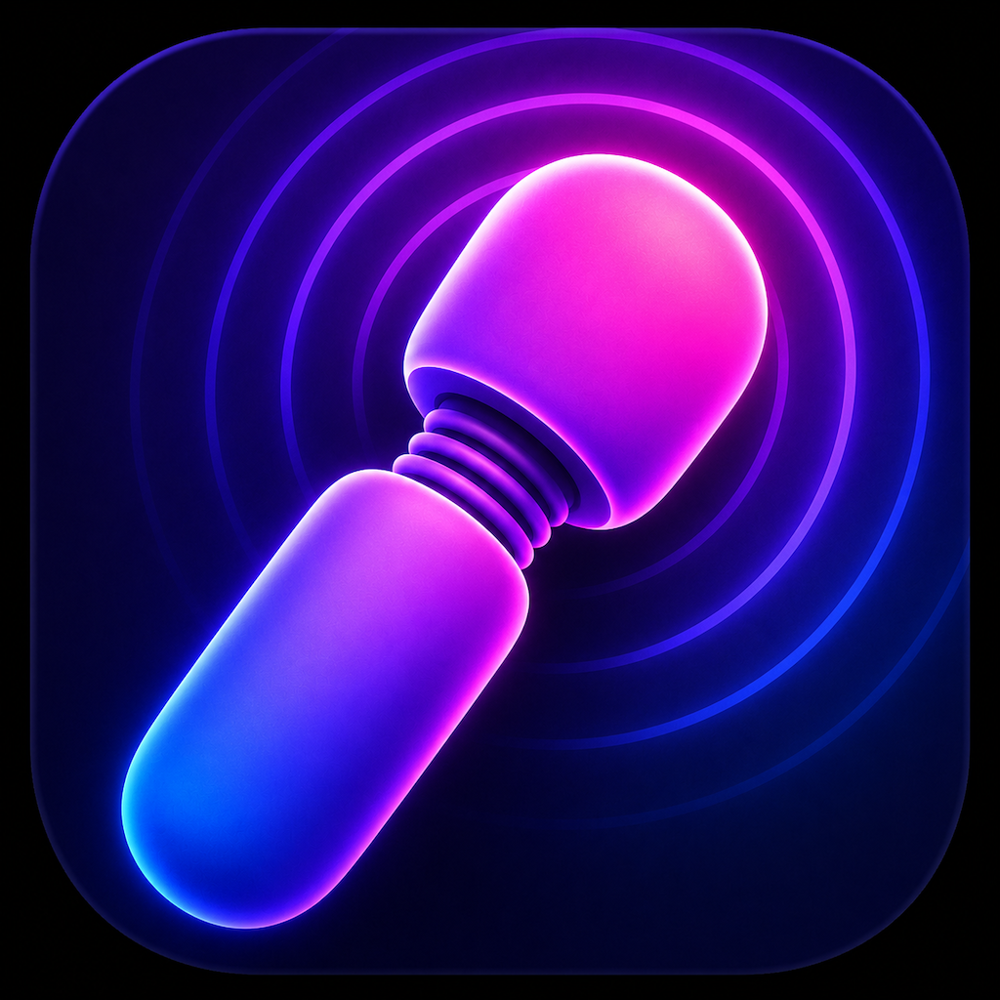

<p align="center">
  
</p>

# Vibeshed

A keyboard-driven macOS launcher built with SwiftUI. Control your Mac with keystrokes — manage windows, switch apps, search browser tabs, control Spotify, and more from a single floating picker.

## Goals

- **Keyboard-first.** Every action reachable in a few keystrokes; mouse optional.
- **Native and unobtrusive.** Pure SwiftUI, menu-bar only, no Dock icon, no Electron.
- **Modular by default.** Each integration is a separate module; load only what you configure.
- **Hackable config.** One YAML file at `~/.config/vibeshed/config.yaml` with hot-reload.
- **Composable actions.** Anything triggerable from the picker is also reachable via `vibeshed://` URLs and key combos.
- **Local-first.** No telemetry. State and history stay on disk.

## Non-goals

- **Not a cross-platform tool.** macOS only. No plans for Linux/Windows.
- **Not a Raycast/Alfred replacement.** No store, no plugin marketplace, no paid tier — modules ship in-tree.
- **Not a scripting platform.** Workflows belong in shell/AppleScript; Vibeshed dispatches, it does not orchestrate.
- **No mobile companion, no cloud sync, no AI chat surface inside the picker.**
- **No GUI configuration.** Config is YAML; if that's a dealbreaker, this is the wrong tool.

## Features

**Launcher**
- Fuzzy-matched searchable picker with keyboard navigation and preview pane
- Usage-aware sorting that adapts to how you work
- Context-sensitive action boosting based on focused app, time of day, audio state
- Dynamic theming that shifts with your system appearance and vibe

**Window Management**
- Cycle window sizes anchored to screen edges, tile halves, maximize/restore
- Enlarge/shrink while keeping split position
- Focus windows by title or app name

**Applications & Browser**
- Launch, focus, or quit any app
- Search and switch browser tabs across Safari and Chromium browsers
- Browser bookmarks and most-visited sites
- Default browser with per-URL routing to specific browsers/profiles

**Productivity**
- Clipboard history with search and paste
- Timers and reminders
- Math expressions, unit conversions, currency conversion
- Calendar events with one-click join for Zoom/Meet
- Meeting prep: hide distractions and surface relevant docs

**Developer Tools**
- VSCode, JetBrains, and Zed project/workspace search
- iTerm session management and command execution
- GitHub repo/issue/PR search and notifications
- AI session search and resume across Claude Code, Claude Desktop, and Codex
- Homebrew package search, install, upgrade, and cleanup

**Media & Communication**
- Spotify search and playback control with OAuth
- System audio volume, mute, device selection, media keys
- Telegram chat quick-open
- Zoom meeting join, start, and configured meeting shortcuts

**System**
- Lock, sleep, restart, shutdown, toggle dark mode
- Empty trash, flush DNS, purge memory, screenshots
- App-scoped key remapping (remap keys per-application)
- Global and per-app key combo bindings
- Custom action aliases with keyword search

## Requirements

- macOS 14 (Sonoma) or later
- Swift 5.9+ (for building from source)

## Installation

```bash
git clone https://github.com/idmitriev/vibeshed.git
cd vibeshed
make build
make run
```

The app runs as a menu bar item (no Dock icon). Use `make run-debug` to see logs in the terminal, or `make log` in a separate terminal for live OSLog streaming.

## Configuration

Configuration lives at `~/.config/vibeshed/config.yaml`. Copy the example to get started:

```bash
cp config.example.yaml ~/.config/vibeshed/config.yaml
```

See [config.example.yaml](config.example.yaml) for all available options including keybindings, module settings, URL routing rules, and action aliases.

The app watches the config file for changes and hot-reloads automatically.

## Modules

| Module | Description |
|--------|-------------|
| **Window** | Resize, move, tile, cycle, maximize/restore, focus windows |
| **Tiling** | Per-display grid tiling, auto-tile, directional moves, focus border |
| **Application** | Launch, focus, quit applications |
| **Menu** | Search and click the frontmost app's menu bar items |
| **Processes** | List and kill running processes |
| **Browser** | Search/focus/close tabs in Safari and Chromium browsers |
| **Bookmark** | Browser bookmarks and most-visited URLs |
| **Clipboard** | Clipboard history with search, paste, and persistence |
| **Audio** | Volume, mute, device selection, media key control |
| **System** | Lock, sleep, restart, shutdown, appearance, screenshots |
| **Settings** | Open macOS System Settings panes |
| **Spotify** | Search artists/albums/playlists, playback control |
| **GitHub** | Search repos, issues, PRs; view notifications |
| **VSCode** | Search and open recent projects |
| **JetBrains** | Search and open IDE projects |
| **ITerm** | Session listing, command execution, new tabs |
| **Claude** | Resume Claude Code/Desktop sessions, start new ones, jump to sessions awaiting input |
| **Codex** | Resume Codex threads with project/branch/model context, start new sessions |
| **Zed** | Search and open recent workspaces |
| **Homebrew** | Search, install, uninstall, upgrade packages and casks |
| **Zoom** | Join meetings, start personal meeting, configured shortcuts |
| **Telegram** | Quick-open configured chats and groups |
| **Calendar** | Upcoming events, join Zoom/Meet links |
| **MeetingPrep** | Prepare workspace for meetings |
| **Timer** | Set timers and reminders |
| **Math** | Arithmetic, unit/currency conversion |
| **Web Search** | Search the web when nothing else matches |
| **Emoji** | Search and copy/paste emoji |
| **Theme** | Palette themes applied across macOS and apps, with live preview |
| **Self** | Open config, reload modules, view logs, quit |

Modules load only when their config section is present. Each module declares required permissions (accessibility, automation, etc.) and the app guides you through granting them.

## Theming

One palette, applied everywhere at once. `theme/switch` lists the themes; moving the highlight applies each one live, Return keeps it, Esc puts everything back. Every theme is also a direct action (`theme/apply.tokyo-night`) you can bind or alias, plus `theme/next`, `theme/previous`, `theme/reapply` and `theme/fromWallpaper`, which derives a full palette from your current wallpaper.

| Target | What changes | Live? |
|--------|--------------|-------|
| `appearance` | Light/dark mode | ✓ |
| `accent` | Accent (nearest preset) + text highlight (exact color) | ✓ |
| `folders` | "Icon, widget & folder color" (macOS 26+), tinted icons for listed folders | ✓ |
| `pointer` | Pointer fill/outline (needs Full Disk Access) | best-effort |
| `wallpaper` | Theme image, or one generated from the palette in one of 15 styles | ✓ |
| `iterm` | Every open session, plus a "Vibeshed" profile (your default profile's settings, theme colours) made the default, so new windows and restarts keep the theme | ✓ |
| `vscode` | VS Code, Insiders, Cursor, Windsurf, VSCodium via a generated theme extension | ✓* |
| `zed` | Generated `themes/vibeshed.json`, selected in settings | ✓* |
| `jetbrains` | Generated editor scheme; follows "Sync with OS" | on restart |
| `claude` | Claude Code custom theme (`~/.claude/themes`) | ✓ |
| `bat` / `lsd` / `micro` | Generated `Vibeshed.tmTheme` (+ cache rebuild), `colors.yaml`, `vibeshed.micro` | next run |
| `btop` | Generated `vibeshed.theme`, selected in `btop.conf`; running btops reload via SIGUSR2 | ✓ |
| `github` | github.com appearance via an open tab (opt-in) | ✓ |
| `templates` / `hooks` | Your own `{{ key }}` templates and shell commands | ✓ |

\* The very first time the generated theme is installed, the editor may need one reload to discover it; after that, switches apply live.

The picker and the tiling focus border follow the theme's accent too. Terminal tools that use the 16 ANSI colours (e.g. fzf with `--color=hl:4,…`) need no target at all: they follow the iTerm palette live. For bat, select the generated theme once with `--theme=Vibeshed`.

Themes use [Omarchy](https://omarchy.org)'s `colors.toml` key names (`background`, `accent`, `bright_blue`, `color0`…`color15`, …); only background, foreground and the six base hues are required. 64 built-ins: Catppuccin, Tokyo Night, Rosé Pine, Kanagawa, Gruvbox, Everforest, Nord, Solarized, GitHub, Ayu, Nightfox, Flexoki, Melange, One Dark/Light, Dracula, Monokai Pro, Night Owl, Poimandres, Vesper, Moonfly, Sonokai, Iceberg, Vague, plus Omarchy's own (Osaka Jade, Ristretto, Matte Black, Retro 82, Lumon, …) and classic desktops — BeOS, OS/2 Warp, OS/2 Text Mode and NeXTSTEP, with colors taken from the systems themselves. The community and Omarchy palettes are regenerated from their sources by `scripts/generate-builtin-themes.py`. Define your own in config (optionally `base:` another theme), or drop Omarchy theme folders into `~/.config/vibeshed/themes/`:

```yaml
modules:
  theme:
    themes:
      - name: "Midnight"
        base: "Tokyo Night"
        colors: { background: "#0b0b12", accent: "#ff9e64" }
    templates:   # Omarchy placeholder syntax: {{ accent }}, {{ red_rgb }}, {{ mix background green 15% }}
      - source: "~/.config/vibeshed/templates/ghostty.conf.tpl"
        target: "~/.config/ghostty/themes/vibeshed"
        reload: "pkill -USR2 -x ghostty"
```

Generated wallpapers come in 15 styles: glow, mesh gradient, waves, ridges, bokeh, low poly, topographic, retro sunset, retro arcs, halftone, solid, and four from classic systems — Leaves (Haiku's screen saver, the BeOS theme's default), Polyhedra (NeXTSTEP BackSpace's module, which could run as the workspace background), Warp Speed (OS/2 Warp) and Text Mode. Any style works with any theme; the classic themes default to their own. `theme/wallpaperStyle` browses them on the current theme with live preview, and `theme/shuffleWallpaper` re-rolls the variation. They're painted at full display resolution in 16-bit colour and dithered, so soft gradients don't band.

The resolved palette is also exported to `~/Library/Application Support/Vibeshed/Theme/current/` (`colors.toml`, `colors.json`) for scripts.

## Key Bindings

Define bindings in the `keybindings:` config section. Each entry maps a key combo to an action or a key remap:

```yaml
keybindings:
  - combo: "capslock+space"
    action: "app/togglePicker"
  - combo: "capslock+1"
    action: "alias/Safari"
  - combo: "ctrl+h"
    remap: "left"
    app: "com.apple.Terminal"
```

Modifiers: `cmd`, `ctrl`, `option`/`alt`, `shift`, `capslock` (hyper), `space`. Mouse buttons: `mouse1`-`mouse5`.

To hand the keyboard back entirely in certain apps — remote-desktop and VM clients, where the combos belong to the machine on the other end — list their bundle IDs (matched case-insensitively) under `keybindingExclusions:`:

```yaml
keybindingExclusions:
  - "com.realvnc.vncviewer"
```

While one of those apps is focused, every key and mouse event passes straight through: no bindings (including the picker toggle), no remaps, and no capslock/space/tab modifier interception.

The one exception is a bound capslock. VM consoles such as UTM's macOS VMs only mirror the host's CapsLock toggle into the guest, never a press and release, so a Vibeshed running inside the VM could never see capslock held. Instead, while an excluded app is focused, holding capslock is sent as holding F18, and Vibeshed treats a held F18 as capslock. Capslock combos then work inside the VM as long as the guest runs Vibeshed too.

## Architecture

- **Swift Package Manager** with `Package.swift` — no Xcode project required
- **Actor-based modules** for thread-safe concurrent action queries
- **SwiftUI** for picker UI, status bar, and module preview views
- **Combine** for debounced search input
- **NSPanel** subclass for the floating picker window
- **YAML config** with typed per-module schemas, validation, and hot-reload

## Contributing

See [CONTRIBUTING.md](CONTRIBUTING.md) for the dev setup and house style.

## Releases

Built and ad-hoc signed (not notarized) by GitHub Actions on tag push. See [RELEASING.md](RELEASING.md) for the workflow.

## Support

If Vibeshed saves you keystrokes, [sponsor the project](https://github.com/sponsors/idmitriev).

## License

[MIT](LICENSE)
